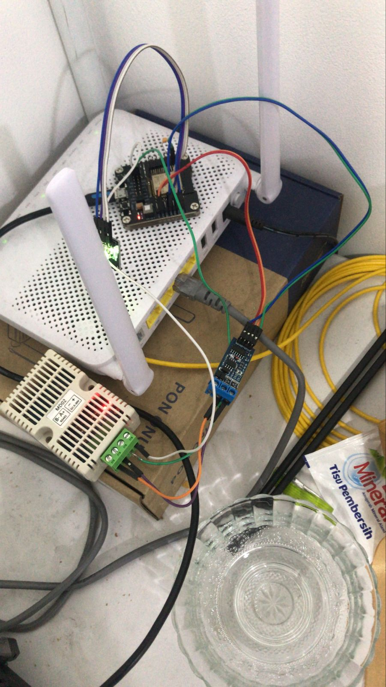

# esp32-advance
using Espressif IoT Development Framework 
(not using aws) see tree tanpa-aws

# update
using RS485 to TTL change DHT22 to XY-MD02
fix web ui and error header too long post ssid and password

# Result

Wiring

User Interface

